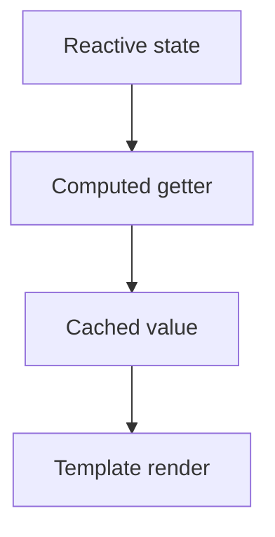

## 🧠 TỔNG QUAN NHANH

Computed property là giá trị được tính toán từ reactive state, và Vue sẽ cache (ghi nhớ) kết quả đó cho đến khi dependency thay đổi.

### 1️⃣ Vấn đề: Vì sao không nên viết logic phức tạp trong template?

❌ **Template bị rối:**
```html
<span>{{ author.books.length > 0 ? 'Yes' : 'No' }}</span>
```
-   Khó đọc.
-   Khó tái sử dụng.
-   Logic lặp lại nhiều nơi.

### 2️⃣ Giải pháp: Computed Properties

✅ **Ý tưởng:** Tách logic ra khỏi template 👉 đặt vào `computed`.

#### 📌 Options API – `computed`
```javascript
export default {
  data() {
    return {
      author: {
        books: ['Vue 3 Guide']
      }
    }
  },
  computed: {
    publishedBooksMessage() {
      return this.author.books.length > 0 ? 'Yes' : 'No'
    }
  }
}
```
```html
<span>{{ publishedBooksMessage }}</span>
```

#### 📌 Composition API – `computed`
```javascript
import { reactive, computed } from 'vue'

const author = reactive({
  books: ['Vue 3 Guide']
})

const publishedBooksMessage = computed(() => {
  return author.books.length > 0 ? 'Yes' : 'No'
})
```
```html
<span>{{ publishedBooksMessage }}</span>
```

> 📌 `computed` trả về một **computed ref**.
> → dùng `.value` trong JS, **không cần** `.value` trong template.

### 3️⃣ Computed hoạt động thế nào? (RẤT QUAN TRỌNG)

🧠 **Vue làm 3 việc:**
1.  **Track dependency** khi computed chạy.
2.  **Cache** kết quả.
3.  **Re-run** chỉ khi dependency thay đổi.

```javascript
const total = computed(() => price.value * quantity.value)
```
➡️ Chỉ khi `price` hoặc `quantity` thay đổi → `total` mới tính lại.

### 4️⃣ Computed vs Methods (Câu hỏi kinh điển)

❓ **Sao không dùng method?**
```html
<p>{{ calculateTotal() }}</p>
```
```javascript
methods: {
  calculateTotal() {
    return this.price * this.quantity
  }
}
```

🚨 **Khác biệt quan trọng:**

| Đặc điểm | Computed | Method |
| :--- | :--- | :--- |
| **Cache** | ✅ Có cache | ❌ Không cache |
| **Trigger** | Chỉ chạy khi dependency đổi | Chạy mỗi lần render |
| **Performance** | Tối ưu | Có thể chậm |

> 📌 Computed = derived state (trạng thái dẫn xuất)
> 📌 Method = hành động

### 5️⃣ Khi nào computed KHÔNG update?

```javascript
const now = computed(() => Date.now())
```

❌ **Không update**
👉 Vì `Date.now()` không phải reactive.

> 📌 Computed chỉ phản ứng với reactive data.

### 6️⃣ Writable Computed (computed có setter)

📌 **Khi cần 2 chiều:**

```javascript
const firstName = ref('John')
const lastName = ref('Doe')

const fullName = computed({
  get() {
    return firstName.value + ' ' + lastName.value
  },
  set(newValue) {
    ;[firstName.value, lastName.value] = newValue.split(' ')
  }
})

fullName.value = 'John Smith'
```
👉 `firstName` & `lastName` tự cập nhật.

### 7️⃣ Lấy giá trị trước đó của computed (Vue 3.4+)

```javascript
const alwaysSmall = computed((previous) => {
  if (count.value <= 3) {
    return count.value
  }
  return previous
})
```

📌 **Dùng khi:**
-   Muốn giữ giá trị cũ.
-   Giới hạn output.

### 8️⃣ Best Practices (RẤT NÊN NHỚ)

✅ **Computed getter PHẢI:**
-   Pure function.
-   Không async.
-   Không mutate state.
-   Chỉ return giá trị.

❌ **KHÔNG:**
```javascript
computed(() => {
  fetch(...)
  count.value++
})
```
📌 Side effects → dùng **watch**.

### 9️⃣ Tư duy đúng về computed

-   Computed không phải function thường.
-   Nó là một **ref đặc biệt** có cache + dependency tracking.

#### 🔁 SO SÁNH NHANH

| Thứ | Dùng khi |
| :--- | :--- |
| `data` / `ref` | state gốc |
| `computed` | state dẫn xuất |
| `method` | hành động |
| `watch` | side effects |

#### 🧠 SƠ ĐỒ TƯ DUY (ghi nhớ nhanh)



## ✅ KẾT LUẬN NGẮN GỌN

-   ✔ Computed = giá trị dẫn xuất.
-   ✔ Tự track dependency.
-   ✔ Có cache → nhanh.
-   ✔ Không side effects.
-   ✔ Thay thế logic phức tạp trong template.